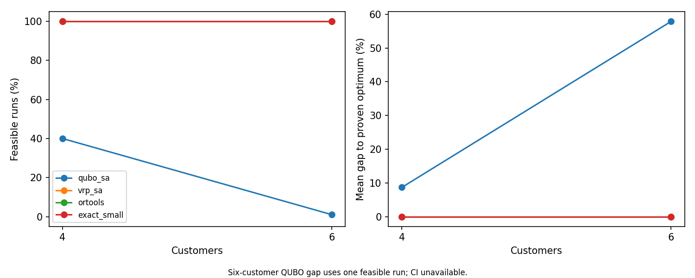

[](https://www.python.org/)
[](LICENSE)
[](https://github.com/abdulazizbalu/quasar-solver/actions/workflows/tests.yml)

<p align="center">
  <strong><a href="https://abdulazizbalu.github.io/quasar-solver/demos/web_demo.html">Route visualization demo</a></strong>
</p>

# Quasar Solver

Quasar Solver is a Python research package for QUBO simulated annealing and small routing experiments. It includes TSP, capacitated vehicle routing (CVRP), and vehicle routing with time windows (VRPTW), with independent feasibility checks and classical reference solvers. The VRP QUBO is restricted to tiny CVRP instances.

## Installation

```bash
pip install -e .
```

For development:

```bash
pip install -e ".[dev]"
```

## Route visualization demo

The linked demo is a standalone JavaScript 2-opt annealer; it does not run the Python QUBO solver. Open it in a browser, place cities, and watch its route visualization.

## Quick Usage

```python
from quasar_solver import QUBO, SimulatedAnnealingSolver
q = QUBO(); q.add(0, 0, -1.0); q.add(1, 1, 2.0)
result = SimulatedAnnealingSolver(seed=42).solve(q)
```

## TSP Demo

The routing demo builds a seeded six-city symmetric distance matrix, converts it to a QUBO with one-hot Travelling Salesman Problem constraints, and solves it with simulated annealing. It prints the best energy, decoded tour, and total route distance when the best sample is valid.

Run it with:

```bash
python demos/routing_demo.py
```

The demo saves a plot of the city coordinates and decoded route to `demos/tour.png`. If the annealer returns an invalid one-hot assignment, the demo prints a warning and still saves the city plot.

## Roadmap

- Schedule optimization
- Financial portfolio demo
- Web UI

## How It Works

QUBO formulation turns an optimization problem into a polynomial over binary variables. Each variable can be either 0 or 1, and the model assigns costs to individual variables and pairs of variables. Hard constraints are usually represented as large penalty terms, so invalid assignments become expensive. Once a problem is in QUBO form, many different search methods can try to minimize its energy.

Simulated annealing is a randomized search method inspired by cooling physical systems. It starts from a random binary sample, flips bits one at a time, and keeps changes that improve the energy. It can also accept worse moves early in the run, which helps it escape shallow local minima. As the temperature cools, the solver becomes more selective and settles into its best-found solution.

For TSP, `QuboSASwapSolver` anneals the same QUBO energy while representing each state as a tour. It holds city 0 at position 0 and proposes swaps of two other cities, so each state remains a valid permutation. Its move cost is computed from the affected tour edges.

## Benchmarks

Run `python -m benchmarks.run_benchmarks` from the repository root to reproduce the raw results, summary, paired comparisons, and chart. Each size has ten seeded Euclidean instances (instance seeds 202600–202609), and each instance has ten solver seeds (0–9). The reference for **every** instance, including 15 and 20 cities, is the proven Held–Karp optimum computed by float64 subset dynamic programming. Raw observations are in [`benchmarks/results/raw.csv`](benchmarks/results/raw.csv); the full tables and confidence intervals are in [`benchmarks/results/summary.md`](benchmarks/results/summary.md).

All three methods receive one read of 100 sweeps, with `100 × n²` attempted operations per run: 3,600, 10,000, 22,500, and 40,000 at 6, 10, 15, and 20 cities. This is `100n` attempts per city. Bit-flip QUBO-SA counts attempted bit flips, permutation-preserving `qubo_sa_swap` counts proposed city swaps, and multi-start `two_opt` counts evaluated tour moves. These operations have different computational costs, so equal counts do not imply equal wall time. A wall-clock limit is available as a secondary cap; it was not used for these results. Mean gaps use feasible runs; the 95% confidence intervals resample the ten independent instances. Measurements were collected with Python 3.14.4 on an Intel64 Family 6 Model 186 Stepping 3 CPU, Windows 11.

| Cities | Solver | Feasible | Mean gap to proven optimum [95% CI] | Attempts | Mean runtime |
| ---: | --- | ---: | ---: | ---: | ---: |
| 6 | qubo_sa | 100/100 | 4.14% [2.72, 5.63] | 3,600 | 0.0424 s |
| 6 | qubo_sa_swap | 100/100 | 0.00% [0.00, 0.00] | 3,600 | 0.0612 s |
| 6 | two_opt | 100/100 | 0.00% [0.00, 0.00] | 3,600 | 0.0365 s |
| 10 | qubo_sa | 99/100 | 32.87% [29.06, 36.61] | 10,000 | 0.1584 s |
| 10 | qubo_sa_swap | 100/100 | 0.27% [0.00, 0.65] | 10,000 | 0.2173 s |
| 10 | two_opt | 100/100 | 0.41% [0.00, 1.23] | 10,000 | 0.1282 s |
| 15 | qubo_sa | 98/100 | 65.22% [60.56, 69.91] | 22,500 | 0.3930 s |
| 15 | qubo_sa_swap | 100/100 | 1.43% [0.52, 2.49] | 22,500 | 0.5060 s |
| 15 | two_opt | 100/100 | 0.00% [0.00, 0.00] | 22,500 | 0.3630 s |
| 20 | qubo_sa | 98/100 | 86.65% [77.37, 95.89] | 40,000 | 0.7410 s |
| 20 | qubo_sa_swap | 100/100 | 3.69% [2.59, 4.97] | 40,000 | 0.9126 s |
| 20 | two_opt | 100/100 | 0.37% [0.00, 1.08] | 40,000 | 0.8145 s |


### Swap schedule tuning

Run `python -m benchmarks.tune_swap` to reproduce the cooling-schedule experiment. It uses instance seeds 303000–303001 and solver seeds 100–102, disjoint from the benchmark. Four schedules were compared over 24 runs each at the same `100 × n²` proposal budget. The lowest aggregate mean gap, 1.698%, came from inverse-temperature endpoints 1 and 30 divided by `max_distance`; the other tested schedules scored 3.225%, 1.879%, and 3.538%. The selected schedule is fixed in `qubo_sa_swap` and in the benchmark. See the [tuning table](benchmarks/results/swap_tuning.md) and [raw tuning results](benchmarks/results/swap_tuning.csv).

### Findings

- Swap moves keep the one-hot assignment valid: all 400 swap runs returned feasible tours, compared with 395/400 bit-flip runs. A swap changes four one-hot bits but leaves the constraint penalty constant, so its energy change comes from the affected tour edges.
- At 20 cities, the swap mean gap is 3.69%, down 82.96 percentage points from bit-flip SA's 86.65%. It remains 3.32 percentage points above 2-opt's 0.37%. At 15 cities, swap is 1.43 percentage points above 2-opt. At 6 cities the two methods tie at the optimum; at 10 cities swap's 0.27% mean gap is 0.14 percentage points below 2-opt's 0.41%, a small difference in these runs.
- The 20-city bit-flip result changed from Phase 1b's 86.03% gap to 86.65% because the reference is now the proven optimum rather than the experiment's best found tour. The exact reference also exposes 2-opt's 0.37% gap at 20 cities. These are changes in the denominator, not improvements in those solvers.
- Under equal attempt counts, swap SA took more wall time than 2-opt at every tested size. The QUBO contains `n²` binary variables (400 at 20 cities); the swap solver avoids invalid states but still builds that QUBO once per run. The measured gap and runtime therefore do not establish an advantage over 2-opt.

### Scope and limits

`qubo_sa_swap` uses the QUBO to define energy, but its moves swap two cities in a tour. Each move flips four one-hot bits at once and leaves the constraint penalty constant. A generic QUBO annealer or quantum hardware running the plain QUBO does not make this move. It is a classical permutation heuristic, so its results do not establish that one-hot QUBO annealing works for TSP.

The `qubo_sa` bit-flip results show what a plain QUBO solver encounters. Handling constraints through penalties is the main obstacle in these runs, and its gap grows quickly with size.

Multi-start 2-opt remains the stronger routing baseline in these experiments. The swap solver also took more wall time under equal attempt counts.

These instances are random Euclidean TSP with at most 20 cities. The results do not establish performance on larger instances or other problem classes.

## Vehicle routing (CVRP and VRPTW)

`CVRPInstance` stores demands, vehicle capacity, fleet size (or unlimited), and a distance matrix with depot node 0. `VRPTWInstance` adds time windows and service times. A VRP `Solution` has `routes`, each starting and ending at node 0. `is_feasible_vrp` checks visits, capacity, fleet size, and time windows independently of the solvers. The optional `ortools` solver uses guided local search; `exact_small` uses OR-Tools CP-SAT and only claims a proven optimum when its status is `OPTIMAL`. `vrp_sa` is a classical route-structure annealer with relocate, swap, and 2-opt proposals. Tiny CVRP `qubo_sa` uses the QUBO bit-flip annealer.

Run the complete experiment from the repository root:

```bash
pip install -e ".[dev,vrp]"
python -m benchmarks.run_vrp_benchmarks
```

The command downloads six checksum-verified third-party instance files into the ignored `benchmarks/data/vrp/` directory, then writes [raw runs](benchmarks/results/vrp_raw.csv), the [full summary](benchmarks/results/vrp_summary.md), [environment details](benchmarks/results/vrp_environment.json), and the chart below. No third-party instance file is redistributed. The 4- and 6-customer cases each use 10 independently generated integer-distance Euclidean instances and 10 solver seeds per instance. The CP-SAT reference is proven optimal for every tiny instance. The standard cases use 10 solver seeds per instance. Results shown here were recorded on Windows 11, Intel64 Family 6 Model 186 Stepping 3, Python 3.14.4, NumPy 2.4.4, and OR-Tools 9.15.6755.

The tiny QUBO solver makes 100 sweeps, one attempted bit flip per QUBO variable per sweep: 4,400 and 8,800 flips at 4 and 6 customers, with a 5-second secondary cap. `vrp_sa` makes 100 proposed moves per customer (400 or 600), also with a 5-second cap. Tiny OR-Tools has a 0.2-second cap. On standard cases both route methods have a 1-second cap; `vrp_sa` usually finishes its fixed 100-proposals-per-customer budget before that cap. Equal wall caps do not make their attempts equivalent. The [formulation and scaling details](docs/vrp_formulation.md) document the QUBO variables, capacity slack bits, and OR-Tools time discretization.

### Tiny CVRP: gap to proven optimum

| Customers | Solver | Feasible | Mean gap among feasible runs [95% CI] | QUBO variables |
| ---: | --- | ---: | ---: | ---: |
| 4 | qubo_sa | 40/100 | 8.67% [5.12, 12.83] | 44 |
| 4 | vrp_sa | 100/100 | 0.00% [0.00, 0.00] | — |
| 4 | ortools | 100/100 | 0.00% [0.00, 0.00] | — |
| 4 | exact_small | 100/100 | 0.00% [0.00, 0.00] | — |
| 6 | qubo_sa | 1/100 | 57.87% [CI unavailable] | 88 |
| 6 | vrp_sa | 100/100 | 0.00% [0.00, 0.00] | — |
| 6 | ortools | 100/100 | 0.00% [0.00, 0.00] | — |
| 6 | exact_small | 100/100 | 0.00% [0.00, 0.00] | — |

The 6-customer QUBO gap comes from one feasible run on one instance; a 95% interval cannot be estimated from it. The full table includes effort, runtime, and vehicle count. Exact results were computed once per instance and reused for the ten solver-seed comparisons.

### Standard instances: gap to published reference

| Instance | Reference | Solver | Feasible | Same fleet as reference | Mean distance gap on comparable runs |
| --- | ---: | --- | ---: | ---: | ---: |
| A-n32-k5 | 784 | ortools | 10/10 | 10/10 | 1.53% |
| A-n32-k5 | 784 | vrp_sa | 10/10 | 10/10 | 35.64% |
| A-n33-k5 | 661 | ortools | 10/10 | 10/10 | 0.30% |
| A-n33-k5 | 661 | vrp_sa | 10/10 | 10/10 | 40.24% |
| A-n37-k5 | 669 | ortools | 10/10 | 10/10 | 0.12% |
| A-n37-k5 | 669 | vrp_sa | 10/10 | 10/10 | 49.88% |
| C101-25 | 3 vehicles, 191.3 | ortools | 10/10 | 10/10 | 0.00% |
| C101-25 | 3 vehicles, 191.3 | vrp_sa | 10/10 | 1/10 | 39.52% |
| R101-25 | 8 vehicles, 617.1 | ortools | 10/10 | 10/10 | 0.94% |
| R101-25 | 8 vehicles, 617.1 | vrp_sa | 10/10 | 3/10 | 11.45% |
| RC101-25 | 4 vehicles, 461.1 | ortools | 10/10 | 10/10 | 0.00% |
| RC101-25 | 4 vehicles, 461.1 | vrp_sa | 10/10 | 0/10 | n/a |

The [CVRPLIB Augerat A reference table](https://galgos.inf.puc-rio.br/cvrplib/en/instances/1) supplies the three CVRP optimal values. The Solomon 25-customer distances are reported in [Pisinger and Ropke's technical report, Table 19](https://backend.orbit.dtu.dk/ws/portalfiles/portal/3154462/A%20general%20heuristic%20for%20vehicle%20routing%20problems_TechRep_Pisinger_Ropke.pdf), and the fleet sizes appear with these values in [Table 6 of a later comparison](https://pmc.ncbi.nlm.nih.gov/articles/PMC11784799/). [SINTEF describes the benchmark](https://www.sintef.no/projectweb/top/vrptw/solomon-benchmark/). These published values are cited, not independently re-proven here. The CVRPLIB downloads come from the official library; the Solomon data come from a [pinned public mirror](https://github.com/BUAAxyf/Solomon100/tree/23f7cf053cc7c0a7740de246791df3ece179c8df/data/solomon_100) because the original archive rejected automated downloads. The downloader checks SHA-256 for every file.



### VRP findings

The tiny QUBO uses 44 variables at four customers and 88 at six. Under the stated bit-flip budget, feasible runs fell from 40/100 to 1/100. Its 6-customer gap is based on one route, so the main finding there is the low feasibility rate. The implementation stops at six customers or 100 variables; these results do not support using this formulation on standard-size CVRP.

Both route methods and the exact solver returned feasible tours in all tiny runs. On the three Augerat instances, OR-Tools was 0.12–1.53% above the published reference under its one-second cap; `vrp_sa` was 35.64–49.88% above it under 100 proposals per customer. On the three Solomon cases, OR-Tools matched the published fleet size in every run and its distance gaps were 0.00%, 0.94%, and 0.00%. `vrp_sa` often used more vehicles; no RC101 run matched the published four-vehicle fleet, so a comparable distance gap is unavailable. The standard benchmarks each contain one instance, so the ten solver seeds do not provide an instance-level confidence interval.

### VRP scope and limits

The QUBO experiment covers only tiny, integer-distance, two-vehicle CVRP. `vrp_sa` is a classical routing heuristic, not a generic QUBO solver. The published standard reference values are cited and were not re-proven. The Solomon comparison uses the first 25 customers, with Euclidean distance and travel time truncated to one decimal, matching the cited reference convention. No result here establishes performance on larger VRP instances or other problem classes.
