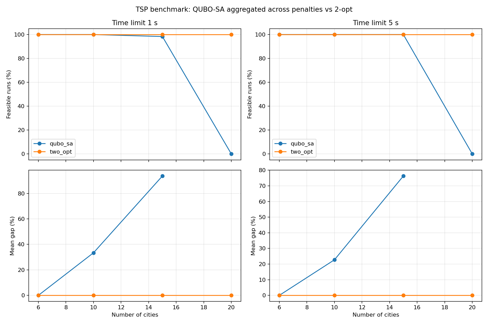

[](https://www.python.org/)
[](LICENSE)
[](https://github.com/abdulazizbalu/quasar-solver/actions/workflows/tests.yml)

<p align="center">
  <strong><a href="https://abdulazizbalu.github.io/quasar-solver/demos/web_demo.html">Route visualization demo</a></strong>
</p>

# Quasar Solver

Quasar Solver is a pure Python, quantum-inspired optimizer for quadratic unconstrained binary optimization (QUBO) problems. It provides a compact QUBO model, a NumPy-based simulated annealing solver, and converters for practical optimization examples.

## Installation

```bash
pip install -e .
```

For development:

```bash
pip install -e ".[dev]"
```

## Route visualization demo

The linked demo is a standalone JavaScript 2-opt annealer; it does not run the Python QUBO solver. Open it in a browser, place cities, and watch its route visualization.

## Quick Usage

```python
from quasar_solver import QUBO, SimulatedAnnealingSolver
q = QUBO(); q.add(0, 0, -1.0); q.add(1, 1, 2.0)
result = SimulatedAnnealingSolver(seed=42).solve(q)
```

## TSP Demo

The routing demo builds a seeded six-city symmetric distance matrix, converts it to a QUBO with one-hot Travelling Salesman Problem constraints, and solves it with simulated annealing. It prints the best energy, decoded tour, and total route distance when the best sample is valid.

Run it with:

```bash
python demos/routing_demo.py
```

The demo saves a plot of the city coordinates and decoded route to `demos/tour.png`. If the annealer returns an invalid one-hot assignment, the demo prints a warning and still saves the city plot.

## Roadmap

- VRP support
- Schedule optimization
- Financial portfolio demo
- Web UI

## How It Works

QUBO formulation turns an optimization problem into a polynomial over binary variables. Each variable can be either 0 or 1, and the model assigns costs to individual variables and pairs of variables. Hard constraints are usually represented as large penalty terms, so invalid assignments become expensive. Once a problem is in QUBO form, many different search methods can try to minimize its energy.

Simulated annealing is a randomized search method inspired by cooling physical systems. It starts from a random binary sample, flips bits one at a time, and keeps changes that improve the energy. It can also accept worse moves early in the run, which helps it escape shallow local minima. As the temperature cools, the solver becomes more selective and settles into its best-found solution.

For TSP, `QuboSASwapSolver` anneals the same QUBO energy while representing each state as a tour. It holds city 0 at position 0 and proposes swaps of two other cities, so each state remains a valid permutation. Its move cost is computed from the affected tour edges.

## Benchmarks

Run `python -m benchmarks.run_benchmarks` from the repository root to reproduce the raw results, summary, paired comparisons, and chart. Each size has ten seeded Euclidean instances (instance seeds 202600–202609), and each instance has ten solver seeds (0–9). The reference for **every** instance, including 15 and 20 cities, is the proven Held–Karp optimum computed by float64 subset dynamic programming. Raw observations are in [`benchmarks/results/raw.csv`](benchmarks/results/raw.csv); the full tables and confidence intervals are in [`benchmarks/results/summary.md`](benchmarks/results/summary.md).

All three methods receive one read of 100 sweeps, with `100 × n²` attempted operations per run: 3,600, 10,000, 22,500, and 40,000 at 6, 10, 15, and 20 cities. This is `100n` attempts per city. Bit-flip QUBO-SA counts attempted bit flips, permutation-preserving `qubo_sa_swap` counts proposed city swaps, and multi-start `two_opt` counts evaluated tour moves. These operations have different computational costs, so equal counts do not imply equal wall time. A wall-clock limit is available as a secondary cap; it was not used for these results. Mean gaps use feasible runs; the 95% confidence intervals resample the ten independent instances. Measurements were collected with Python 3.14.4 on an Intel64 Family 6 Model 186 Stepping 3 CPU, Windows 11.

| Cities | Solver | Feasible | Mean gap to proven optimum [95% CI] | Attempts | Mean runtime |
| ---: | --- | ---: | ---: | ---: | ---: |
| 6 | qubo_sa | 100/100 | 4.14% [2.72, 5.63] | 3,600 | 0.0424 s |
| 6 | qubo_sa_swap | 100/100 | 0.00% [0.00, 0.00] | 3,600 | 0.0612 s |
| 6 | two_opt | 100/100 | 0.00% [0.00, 0.00] | 3,600 | 0.0365 s |
| 10 | qubo_sa | 99/100 | 32.87% [29.06, 36.61] | 10,000 | 0.1584 s |
| 10 | qubo_sa_swap | 100/100 | 0.27% [0.00, 0.65] | 10,000 | 0.2173 s |
| 10 | two_opt | 100/100 | 0.41% [0.00, 1.23] | 10,000 | 0.1282 s |
| 15 | qubo_sa | 98/100 | 65.22% [60.56, 69.91] | 22,500 | 0.3930 s |
| 15 | qubo_sa_swap | 100/100 | 1.43% [0.52, 2.49] | 22,500 | 0.5060 s |
| 15 | two_opt | 100/100 | 0.00% [0.00, 0.00] | 22,500 | 0.3630 s |
| 20 | qubo_sa | 98/100 | 86.65% [77.37, 95.89] | 40,000 | 0.7410 s |
| 20 | qubo_sa_swap | 100/100 | 3.69% [2.59, 4.97] | 40,000 | 0.9126 s |
| 20 | two_opt | 100/100 | 0.37% [0.00, 1.08] | 40,000 | 0.8145 s |



### Swap schedule tuning

Run `python -m benchmarks.tune_swap` to reproduce the cooling-schedule experiment. It uses instance seeds 303000–303001 and solver seeds 100–102, disjoint from the benchmark. Four schedules were compared over 24 runs each at the same `100 × n²` proposal budget. The lowest aggregate mean gap, 1.698%, came from inverse-temperature endpoints 1 and 30 divided by `max_distance`; the other tested schedules scored 3.225%, 1.879%, and 3.538%. The selected schedule is fixed in `qubo_sa_swap` and in the benchmark. See the [tuning table](benchmarks/results/swap_tuning.md) and [raw tuning results](benchmarks/results/swap_tuning.csv).

### Findings

- Swap moves keep the one-hot assignment valid: all 400 swap runs returned feasible tours, compared with 395/400 bit-flip runs. A swap changes four one-hot bits but leaves the constraint penalty constant, so its energy change comes from the affected tour edges.
- At 20 cities, the swap mean gap is 3.69%, down 82.96 percentage points from bit-flip SA's 86.65%. It remains 3.32 percentage points above 2-opt's 0.37%. At 15 cities, swap is 1.43 percentage points above 2-opt. At 6 cities the two methods tie at the optimum; at 10 cities swap's 0.27% mean gap is 0.14 percentage points below 2-opt's 0.41%, a small difference in these runs.
- The 20-city bit-flip result changed from Phase 1b's 86.03% gap to 86.65% because the reference is now the proven optimum rather than the experiment's best found tour. The exact reference also exposes 2-opt's 0.37% gap at 20 cities. These are changes in the denominator, not improvements in those solvers.
- Under equal attempt counts, swap SA took more wall time than 2-opt at every tested size. The QUBO contains `n²` binary variables (400 at 20 cities); the swap solver avoids invalid states but still builds that QUBO once per run. The measured gap and runtime therefore do not establish an advantage over 2-opt.

### Scope and limits

`qubo_sa_swap` uses the QUBO to define energy, but its moves swap two cities in a tour. Each move flips four one-hot bits at once and leaves the constraint penalty constant. A generic QUBO annealer or quantum hardware running the plain QUBO does not make this move. It is a classical permutation heuristic, so its results do not establish that one-hot QUBO annealing works for TSP.

The `qubo_sa` bit-flip results show what a plain QUBO solver encounters. Handling constraints through penalties is the main obstacle in these runs, and its gap grows quickly with size.

Multi-start 2-opt remains the stronger routing baseline in these experiments. The swap solver also took more wall time under equal attempt counts.

These instances are random Euclidean TSP with at most 20 cities. The results do not establish performance on larger instances or other problem classes.
